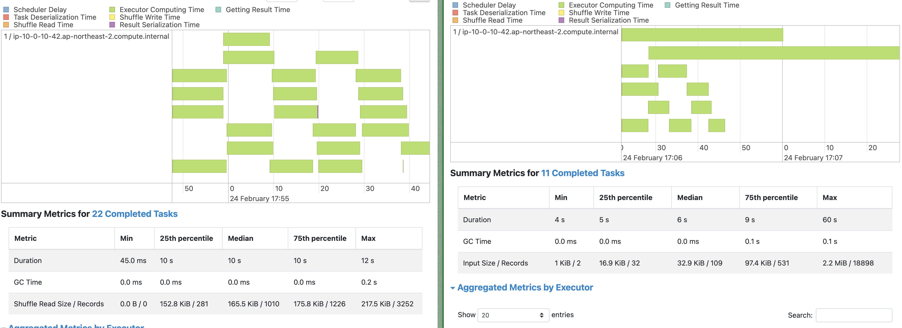
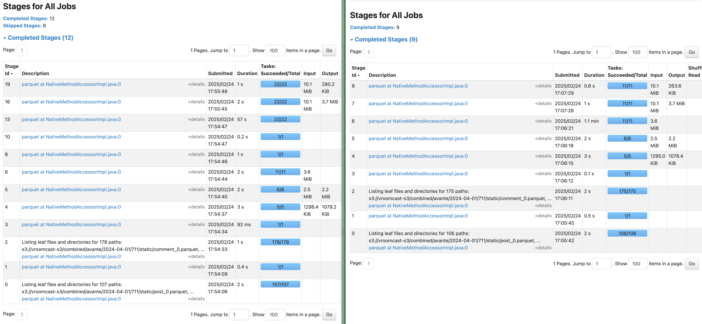

# Spark Data Skew 처리 성능 비교 분석

---

## 개요
이 문서는 PySpark에서 데이터 스큐(Data Skew)를 처리하기 전과 후의 성능을 비교하고, 그 차이를 분석한 결과를 담고 있다. 
데이터 스큐를 처리하지 않을 경우 일부 태스크가 과부하가 걸리는 문제가 발생하며, 이를 해결하기 위해 문장 길이 누적합 기반 파티셔닝을 적용하였다.

---

## 성능 비교 (스큐 처리 전 vs 후)

### 1. Task 분포 및 실행 시간 비교

|  | 스큐 처리 O (왼쪽) | 스큐 처리 X (오른쪽) |
|---|---|---|
| Task 개수 | 22개 | 11개 |
| Task 실행 시간 (평균) | 10~12초 | 최대 60초 |
| 과부하 태스크 발생 여부 | 없음 (균등한 분포) | 과부하 발생 (특정 태스크가 60초 소요) |

스큐를 처리한 후 태스크가 더 균등하게 나뉘었고, 특정 태스크가 과부하가 걸리는 현상이 줄어들었다.

---

### 2. Shuffle Read / Write 크기 비교

스큐를 처리한 후 태스크 간 데이터 양이 고르게 분배되었다.

---

## 결론: 데이터 스큐 처리 효과

- 작업이 균등하게 분배되어, 전체 실행 시간이 최적화되었다.
- 특정 태스크가 과부하 걸리는 현상이 사라졌으며, 전체 태스크가 비슷한 시간 내에 종료되었다.

---

## 최적화 정리

### 스큐 처리를 위해 적용한 최적화 방법
- 문장 길이(`sentence_length`) 기반 누적합(`cumulative_length`)을 계산하였다.
- 100,000자 단위(`partition_size=100000`)로 파티셔닝하여 균등한 데이터 분배를 수행하였다.
- `repartitionByRange("partition_id")`를 사용하여 스큐를 완화하였다.
- UDF 실행 전에 균등한 데이터 분배를 적용하였다.

결과적으로, Spark Job의 데이터 스큐 문제를 해결하고 전체 성능을 최적화할 수 있었다.

